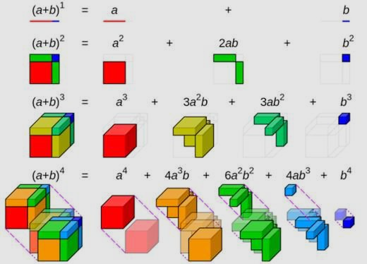
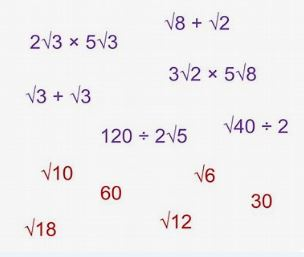

<html>
<body>

<head>
 
</head>

 Below is a list of some topics for A Math.

 
  
 <button onclick="binomial()"> Binomial Theorem </button>

 
  
 <button onclick="surds()"> Surds </button>

   Click on any topic to get notes! 

</body>
</html>
